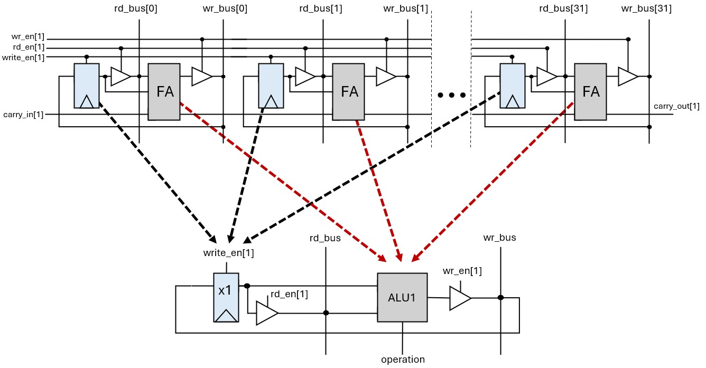
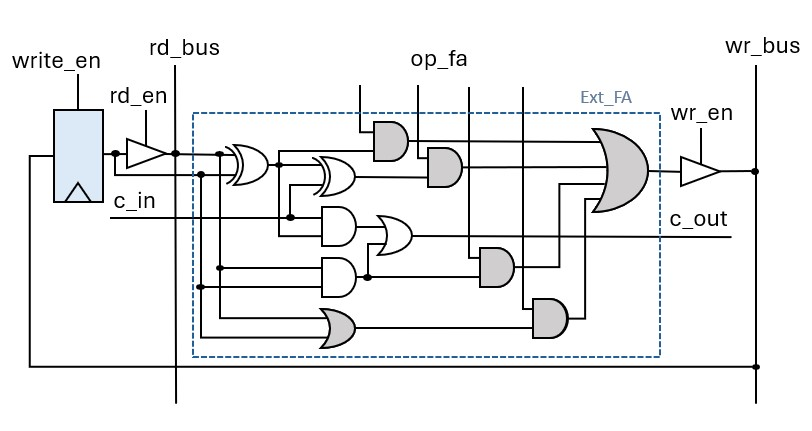
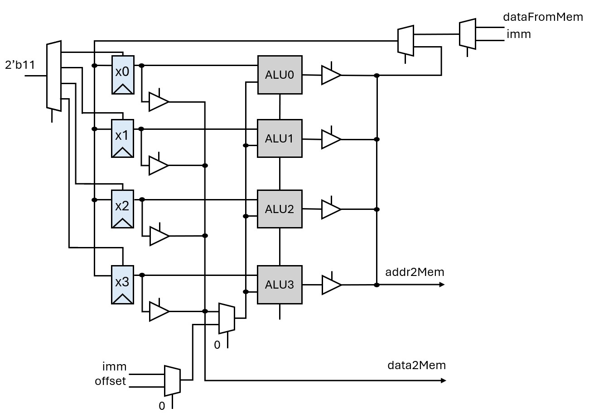
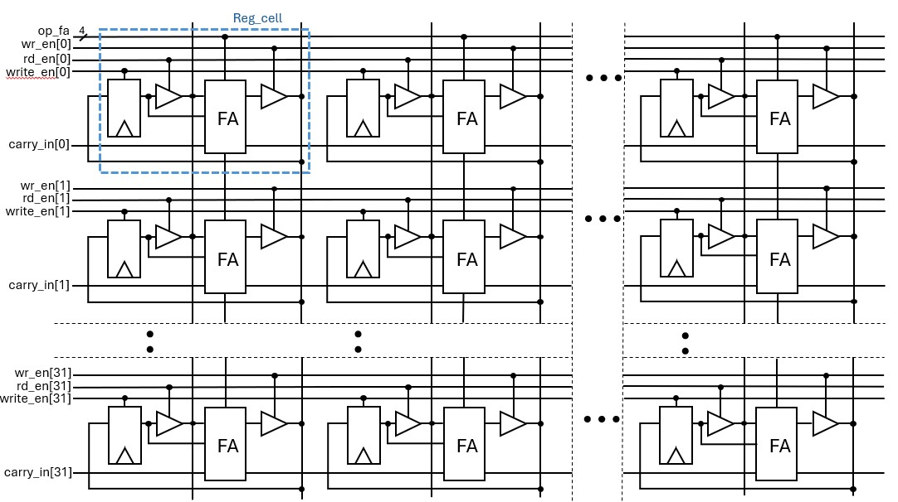
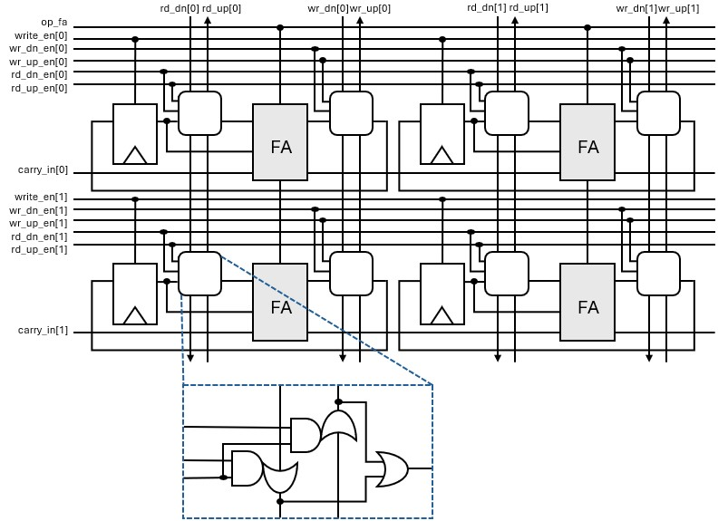
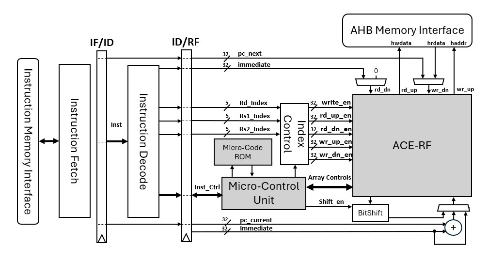
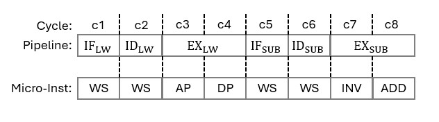
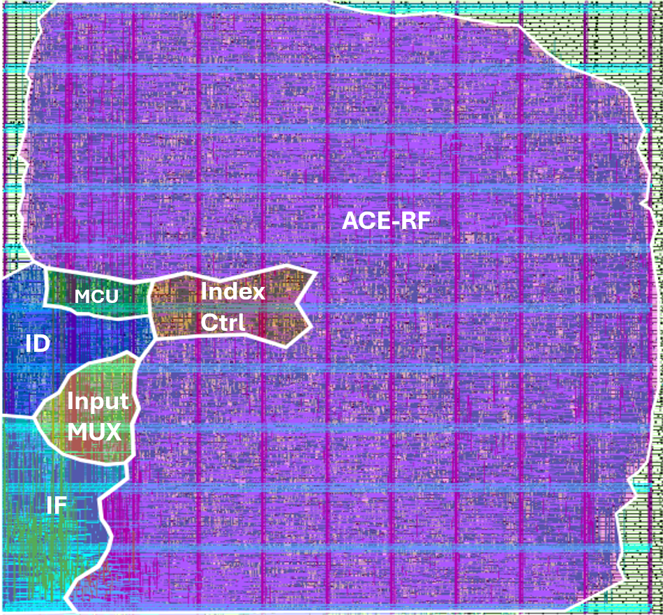
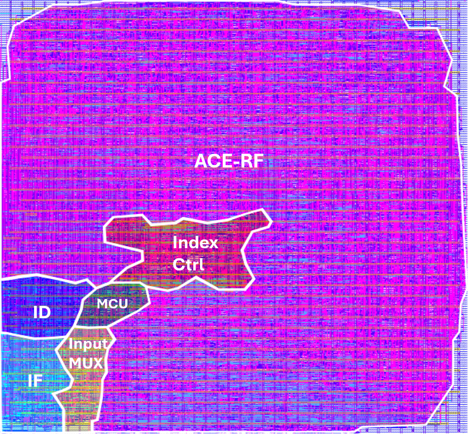

# RISC-V Processor with In-Register File Processing

This repository contains the implementation to the Thesis Project: "RISC-V Processors with In Register File Processing".

## Abstract

This thesis examines an innovative RISC-V processor architecture based on in-register file computing, aiming to reduce area and energy requirements for resource-constrained
applications. The main contribution of this work is the development of the ACE-RF
(Arithmetic Capable Enhanced-Register File), a register file that incorporates bit-level
computational capabilities, effectively turning each register into an active computing
node. The architecture avoids the use of a centralized Arithmetic Logic Unit (ALU),
achieving significant area and energy savings through localized operations within a
fully uniform array of purely digital logic cells. The work includes the design and
implementation of the architecture in SystemVerilog, physical design using the
OpenROAD toolchain, and functional verification on an FPGA prototype. The results
indicate that the proposed solution is suitable for ultra-low-cost, high energy-efficiency
systems, while offering functionality comparable to other conventional approaches. 

## In Register Processing

The proposed Architecture is based upon a simple but ambitious question: "How can we design a fully functioning core for the RISC-V Base ISA using sets of a D Flip-Flop and a Full Adder?". The answer can be better explained in a bottom-up approach. The flip flop is connected to the Adder through two data ports. First a read port that is used to get values from input or the registered bit and a write port that is used to get the result or to register data in the flip-flop. Tri-state buffers are used to control the flow of data in the ports. In that way a new register cell is formed that is capable of simple addition. Such cells can be connected serially to form a full 32-bit register.

<figure align="center">
  
  
  <figcaption>
    <b>Figure 1:</b> The concept of Local Register-ALU pair.
  </figcaption>
</figure>

Provided that we can extend the capabilities of the Full Adder we can clearly see why connecting those cells in that fashion is usefull. In a higher level of abstraction we have constructed a register that includes a local ALU and is fully capable of computing and saving information. The extension needed in the Full Adder circuit is shown below.

<figure align="center">
  
  
  <figcaption>
    <b>Figure 2:</b> The Extended Full Adder.
  </figcaption>
</figure>

The Logic XOR and AND operation of the inputs already takes place in the basic Adder circuit so we only need to add the OR operation and we choose the output according to the op_fa signal. This signal as well as all the control signals of the tristate buffers and the write enable signals of the registers are all in one hot encoding in order to avoid bus contention problems. Other operations such as SUB or Branches are executed by re-using this hardware and they require more than one cycle to complete. These simple logic operations are enough to make a functioning processor from the Register-ALU pair. 

## The New Organization of the Processor

<figure align="center">
  
  
  <figcaption>
    <b>Figure 3:</b> The new organization of computing In-Register.
  </figcaption>
</figure>

### Instruction Execution
The ports of each register are connected so the data can flow in both ports through all the registers. This makes possible to compute the addition (or logic operations) of two registers and save the result. From the instruction fetched we use the register indexes to control the data flow. The Rs1 index is responsible to determine in which ALU the execution will take place. The Rs2 index controls the registered data flow through the read bus. The local ALU takes as input the logal registered bits and the read bus current data. The Rd index determines which register will save the result. In similar fashion we can add with immediate values carried in the instruction. Instead of letting Rs2 index to pass data from registers we enable the immediate value to flow through the read bus and use that for the calculation. To save the immediate values in the register in instruction like LUI and AUIPC we let the values flow through the write bus. 

### Memory Communication
A suited communication protocol for this project was AMBA AHB-Lite a widely used protocol in industry. The basic working principle of the AHB communication is that the transfers are divided in two phases. The Address phase that the master informs the subordinate for the corresponding address of memory and the Data phase in which the information is passed through. The first phase needs a simple addition to be done in register as we already discussed and the data phase requires only controlling the right bus on the datapath either to send data to the memory or load data back. 

## ACE-RF

In that way register cells with FAs create register rows with local ALUs and register rows stacked upon each other create a highly regular register array that is capable of computing most of the instructions in RV32I set while being fully synthesizable from only digital cells.

<figure align="center">
  
  
  <figcaption>
    <b>Figure 4:</b> The design of the ACE-RF.
  </figcaption>
</figure>

Although the use of tri-state buffers was a prefered starting point to explain the working principle of in-register computing it was not included in the final implementation of the ACE-RF in order not to have any problems with synthesis and the FPGA implementation. We substitute the bidirectional buses with one-directional nets. One that goes upward in the array and one downwards for each bus. That concludes the design of the ACE-RF unit.

<figure align="center">
  
  
  <figcaption>
    <b>Figure 5:</b> The final form of the ACE-RF.
  </figcaption>
</figure>

## Architecture Overview

<figure align="center">
  
  
  <figcaption>
    <b>Figure 6:</b> Simplified block diagram of the ACE-RF architecture showcasing decentralized computation.
  </figcaption>
</figure>

The full layout of the processor consists of 3 stages. The fetch stage, the decode stage and the RF stage. The fetch stage takes the instruction from a simple memory then passes it to the decode and controls the program counter. The decode stage prepares the indexes and the address of a micro-coded controler unit. In the register file stage the next instruction is stalled and the control passes to the micro-control unit. There starts the execution of the instruction in the ACE-RF. Instructions can have from 1 to 4 cycles. The signals to control the ACE-RF on each cycle are stored in a micro-coded ROM and they are being processed serialy. An example of execution is shown below.

<figure align="center">
  
  
  <figcaption>
    <b>Figure 7:</b> Instruction Execution in the register file.
  </figcaption>
</figure>

## Physical Layout using OpenROAD

  
  <figure style="width: 48%;">
    
    <figcaption align="center">
      <b>Figure 8:</b> Physical layout of the design in 7nm.
    </figcaption>
  </figure>

  <figure style="width: 48%;">
    
    <figcaption align="center">
      <b>Figure 9:</b> Physical layout of the design in 130nm.
    </figcaption>
  </figure>

### Comparisons

| Core | Max Place Density | Max Core Utilization | Total Area (μm^2)|
| :--- | :---: | :---: | :---: |
| ACE-RF | 90% | 80% | 2.571 |
| IBEX | 72% | 76% | 2.317 |

<b>Table 1:</b> Area Comparison in 7nm.

| Core | Max Place Density | Max Core Utilization | Total Area (μm^2)|
| :--- | :---: | :---: | :---: |
| ACE-RF | 72% | 77% | 214.543 |
| IBEX | 60% | 69% | 137.620 |

<b>Table 2:</b> Area Comparison in 130nm.

Total Area comparisons were made with IBEX from low-RISC a well established open-source CPU core that aims in low power and low cost applications. IBEX is very extensively verified and has seen multiple tape-outs so it serves as a solid basis for comparison. 
As seen in both 7nm and 130nm technologies the proposed design shows promising results in total area of the chip.

## Credits

<b>Author:</b> Nikolaos Papaioannou at ECE Dept. DUTH

<b>Supervisor:</b> Prof. Georgios Dimitrakopoulos at Integrated Circuits Lab @ DUTH
<!-- 
## FPGA Validation Prototype
After the verification of the Processor behavior in ModelSim testbenches of simple programs where the execution was cheched cycle after cycle a next step is to validate and demonstrate the design through a FPGA platform. The following simple system integrates the CPU with memory modules and IPs from the IP catalog of Xilinx Vivado. The system aims to show an animation through a VGA screen controlled by the processor. 
<figure align="center">
  
  
  <figcaption>
    <b>Figure 10:</b> The FPGA Demo SoC .
  </figcaption>
</figure> -->

